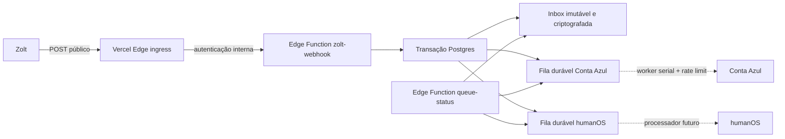

# Sales Middleware

API de entrada e distribuição resiliente para integrações de vendas. O fluxo
atual recebe webhooks públicos da Zolt, preserva cada entrega e cria, na
mesma transação, um item durável para Conta Azul e outro para humanOS.

Os disparos externos ficam desligados por padrão. A aplicação de produção
`HumanOS` está conectada à Conta Azul por OAuth, com renovação atômica de tokens,
cliente administrativo e worker. O mapeamento Zouti foi validado contra eventos
reais e a conta financeira `Zouti - Conta Corrente`; os eventos só serão enviados
depois de uma ativação explícita de `dispatch_enabled`.

## Endpoint de produção

O endereço público no domínio da Human Academy é:

```text
https://mid.humanacademy.ai/webhook
```

Para classificar plataforma e evento já na entrada, cadastre por exemplo:

```text
https://mid.humanacademy.ai/webhook?platform=zouti&event=agl2
```

Os dois parâmetros são opcionais e independentes. Sem `platform`, a coluna de
origem recebe `zolt`; sem `event`, a coluna de evento fica nula. Quando enviados,
os valores continuam dentro da query integral e também são materializados nas
colunas indexadas `source_platform` e `source_event_type`.

Ele aceita qualquer `POST` sem exigir header ou segredo da Zolt e encaminha o
request integral para o receptor durável no Supabase, adicionando a autenticação
somente no salto interno. O endereço direto, com uma etapa a menos e recomendado
como fallback administrativo, é:

```text
https://hyvomeibqlfchxqaevkc.supabase.co/functions/v1/zolt-webhook
```

O endereço direto exige `Authorization: Bearer <ZOLT_WEBHOOK_SECRET>`. Ele aponta
para a Edge Function que persiste inbox e filas na mesma transação.

O endereço de descoberta e saúde publicado no Vercel é
`https://mid.humanacademy.ai`. Ele consulta o estado real do Supabase e das
filas: retorna `200 operational` quando a dependência responde corretamente e
`503 degraded` em caso de falha, sem expor segredos, payloads ou volumes.

## Fluxo



## Garantias

- Cada `POST` público gera uma nova linha, inclusive reenvios idênticos.
- A resposta `200` só é enviada depois que inbox e as duas filas foram gravadas.
- Qualquer falha nessa transação resulta em `503` com `Retry-After`; não existe o
  estado “salvo sem fila” ou “fila sem webhook”.
- O request completo disponível no runtime (método, URL, path, query string,
  parâmetros, headers e bytes exatos do body) é preservado em envelope
  AES-256-GCM.
- `ingest_sequence` define uma ordem global e monotônica independente de empates
  no relógio; `received_at` e `received_at_epoch_ms` preservam o instante de
  ingresso com precisão de milissegundos.
- `platform` e `event` da query são copiados para colunas indexadas sem remover
  ou modificar a query original.
- Cada destino possui estado atual, horário agendado, início/fim de tentativa e
  conclusão; o histórico de tentativas é append-only.
- O claim é FIFO estrito: se o evento mais antigo aguarda retry, nenhum evento
  posterior daquele destino o ultrapassa.
- O JSON fica disponível separadamente para os processadores e o SHA-256 valida
  os bytes exatos do body.
- Credenciais são redigidas das colunas de consulta e preservadas somente no
  envelope criptografado.
- Inbox, filas e auditoria não são acessíveis por `anon` ou `authenticated`.
- A inbox é append-only para `service_role`.
- Payloads nunca são escritos nos logs.
- Cada destino tem lease, tentativas, backoff exponencial com jitter, arquivo de
  sucessos e dead-letter independentes.

O mecanismo de filas é o PGMQ/Supabase Queues em tabelas logged. Uma mensagem
fica invisível durante o lease e volta automaticamente à fila se o worker cair.
Sucessos e dead-letters são arquivados, não apagados.

## Endpoints

### `POST /functions/v1/zolt-webhook`

Aceita o segredo em uma das formas:

```http
Authorization: Bearer <ZOLT_WEBHOOK_SECRET>
X-Zolt-Webhook-Secret: <ZOLT_WEBHOOK_SECRET>
X-Webhook-Secret: <ZOLT_WEBHOOK_SECRET>
```

Resposta após persistência confirmada:

```json
{
  "accepted": true,
  "receipt_id": "00000000-0000-0000-0000-000000000000",
  "received_at": "2026-08-02T00:00:00.123000+00:00",
  "received_at_epoch_ms": 1785628800123,
  "ingest_sequence": 12345,
  "platform": "zouti",
  "event": "agl2"
}
```

### `GET /functions/v1/queue-status`

Endpoint mínimo, protegido por um segredo separado:

```http
Authorization: Bearer <STATUS_API_SECRET>
```

`?recent_limit=20` controla a quantidade de resultados recentes (máximo 100).
O retorno contém volume recebido, pendentes, em lease/retry, sucessos,
dead-letters, idade do item mais antigo e resultados recentes. Ele nunca expõe
body, headers ou envelope.

### `conta-azul-auth`

- `POST /functions/v1/conta-azul-auth/start`: gera uma URL OAuth; requer
  `INTEGRATION_ADMIN_SECRET` (ou `STATUS_API_SECRET` como fallback).
- `GET /functions/v1/conta-azul-auth/callback`: callback público protegido por
  `state` aleatório, com expiração de dez minutos e consumo único.
- `GET /functions/v1/conta-azul-auth/status`: retorna apenas estado e datas da
  conexão, nunca tokens.

Access e refresh tokens são criptografados com AES-256-GCM. O refresh token da
Conta Azul muda a cada renovação, por isso o worker usa lease e grava o novo par
de tokens atomicamente antes de continuar.

### `conta-azul-api`

Endpoint administrativo de homologação. `GET` encaminha filtros para
`/v1/venda/busca`. `POST` cria uma venda somente quando
`CONTA_AZUL_ALLOW_TEST_WRITES=true` e o request inclui
`X-Confirm-Create: CONTA_AZUL_DEVELOPMENT`.

### `POST /functions/v1/conta-azul-worker`

Worker protegido por `CRON_SECRET` (ou pelo segredo administrativo). Apenas uma
execução obtém o lease por vez. Para cada pedido ele correlaciona a identidade
externa, cliente, produtos, venda e financeiro. Antes de criar, busca pelo número
reservado e confirma o ID da ordem nas observações; colisões recebem outro número.
Assim, um ACK perdido não transforma o mesmo pedido em outra venda. A cadência é
serial para respeitar o limite oficial da Conta Azul de 10 requisições/s e
600/min por conta ERP.

## Estrutura

```text
supabase/
├── config.toml
├── migrations/
│   ├── 20260802000000_create_webhook_inbox.sql
│   ├── 20260802010000_create_integration_queues.sql
│   ├── 20260802020000_fix_status_function_volatility.sql
│   ├── 20260802030000_create_conta_azul_oauth.sql
│   ├── 20260802040000_allow_webhook_sale_deduplication.sql
│   ├── 20260802050000_retry_transient_token_refresh.sql
│   ├── 20260802060000_add_ordered_processing_ledger.sql
│   ├── 20260802070000_quarantine_production_load_tests.sql
│   ├── 20260802080000_quarantine_ingress_validation_receipts.sql
│   ├── 20260802090000_quarantine_binary_capture_validation.sql
│   ├── 20260802100000_create_conta_azul_order_sync.sql
│   └── 20260802110000_add_deferred_event_status.sql
└── functions/
    ├── _shared/
    ├── conta-azul-api/
    ├── conta-azul-auth/
    ├── conta-azul-worker/
    ├── queue-status/
    └── zolt-webhook/
scripts/load-test.ts
tests/
├── health.test.ts
└── webhook.test.ts
```

Detalhes de concorrência, estados, falhas e capacidade estão em
[`docs/architecture.md`](docs/architecture.md).

## Configuração e deploy

Pré-requisitos: Supabase CLI, Docker e um projeto Supabase.

```bash
supabase login
supabase link --project-ref SEU_PROJECT_REF
```

Gere três segredos independentes; nunca os versione:

```bash
openssl rand -hex 32
openssl rand -base64 32
openssl rand -hex 32
```

Configure respectivamente `ZOLT_WEBHOOK_SECRET`,
`WEBHOOK_ENCRYPTION_KEY_BASE64` e `STATUS_API_SECRET`:

```bash
supabase secrets set \
  ZOLT_WEBHOOK_SECRET='PRIMEIRO_VALOR' \
  WEBHOOK_ENCRYPTION_KEY_BASE64='SEGUNDO_VALOR' \
  WEBHOOK_ENCRYPTION_KEY_VERSION='1' \
  STATUS_API_SECRET='TERCEIRO_VALOR'
```

```bash
supabase db push
supabase functions deploy zolt-webhook
supabase functions deploy queue-status
supabase functions deploy conta-azul-auth conta-azul-api conta-azul-worker
```

## Desenvolvimento e validação

```bash
npm test
supabase start
```

Exemplo local:

```bash
curl --request POST \
  'http://127.0.0.1:54321/functions/v1/zolt-webhook?campaign=summer' \
  --header 'Authorization: Bearer SEU_SEGREDO_LOCAL' \
  --header 'Content-Type: application/json' \
  --data '{"id":"evt_123","type":"sale.created","amount":150.90}'
```

Teste de carga configurável:

```bash
EVENTS_PER_SECOND=200 DURATION_SECONDS=30 npm run load-test
```

O teste local executado em 2 de agosto de 2026 ofereceu 1.000 eventos em cinco
segundos: 1.000 respostas de sucesso, 1.000 linhas na inbox, 1.000 mensagens em
cada fila e zero perdas.

Na produção, uma oferta de 100 eventos/s durante cinco segundos persistiu
500/500 eventos, com 500 sequências únicas e nenhuma falha, tanto pelo domínio
público quanto diretamente pelo Supabase. Porém, a vazão concluída ficou perto
de 37 eventos/s e a latência p95 perto de 8 segundos. O ambiente preserva os
eventos nesse pico curto, mas o compute atual ainda não sustenta 100–200/s com
latência saudável; é necessário dimensionar o Supabase e repetir um ensaio
prolongado antes de assumir SLA.

Os recibos desses ensaios continuam imutáveis na inbox. Seus itens de fila,
identificados pela plataforma `load_test*`, foram arquivados como dead-letter
operacional para nunca serem enviados aos sistemas reais nem bloquearem o FIFO.

## Contrato Zouti → Conta Azul

O adaptador reconhece como pedido canônico o objeto Zouti cujo `id` começa com
`ord_` e contém `status`, `customer` e `items`. A identidade operacional é o par
`(plataforma, id da ordem)`, não o webhook: reenvios e mudanças posteriores
atualizam a mesma venda.

- `PAID` cria ou atualiza cliente, produtos e venda aprovada, e registra a baixa;
- `AWAITING_PAYMENT` e estados recusados são auditados sem criar venda;
- `REFUNDED`, `CANCELLED` e `DISPUTED` desfazem a baixa e cancelam a venda já
  vinculada;
- uma reversão terminal não pode regredir; `DISPUTED` tem precedência sobre
  `REFUNDED` quando chegar depois;
- pagamento (`pmt_`), assinatura (`sub_`), parcela (`smi_`), solicitação de
  reembolso (`rrq_`) e plataformas sem adaptador ficam em
  `conta_azul_deferred_events`, com vínculo à ordem quando disponível. Eles não
  criam vendas e podem ser reprocessados após a implementação do correlacionador.

Cliente é correlacionado pelo ID da origem e localizado por CPF/CNPJ ou e-mail.
Produto é correlacionado pelo ID da origem e por um SKU determinístico. A venda
guarda número, UUID, versão, conta financeira, categoria, fingerprint e a última
sequência processada. Toda decisão fica em auditoria append-only.

Referências oficiais: [autenticação OAuth](https://developers.contaazul.com/auth),
[renovação do token](https://developers.contaazul.com/renewingaccesstoken) e
[API de vendas](https://developers.contaazul.com/openapi/venda/paths/~1v1~1venda~1busca/get).

## RPCs dos processadores

Os workers usarão estas RPCs internas, disponíveis apenas para `service_role`:

- `claim_integration_jobs`: reserva somente o item ativo mais antigo, com
  visibility timeout e bloqueio FIFO durante retries;
- `complete_integration_job`: registra a tentativa e arquiva um sucesso;
- `fail_integration_job`: agenda retry exponencial ou move para dead-letter;
- `middleware_queue_status`: produz o resumo seguro usado pelo endpoint.

Antes de ativar o despacho Conta Azul em produção ainda é obrigatória uma criação
controlada, seguida da conferência da venda e da baixa na interface. Já concluído:
aplicação de produção `HumanOS`, callback OAuth, tokens criptografados, consultas
reais, conta/categoria Zouti e mapeamento dos formatos recebidos.
