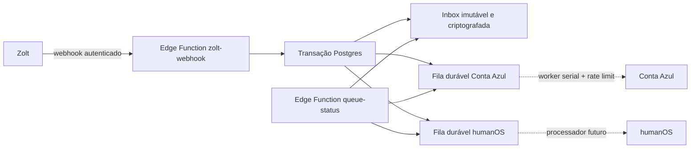

# Sales Middleware

API de entrada e distribuição resiliente para integrações de vendas. O fluxo
atual recebe webhooks autenticados da Zolt, preserva cada entrega e cria, na
mesma transação, um item durável para Conta Azul e outro para humanOS.

Os disparos externos ficam desligados por padrão. A aplicação de produção
`HumanOS` está conectada à Conta Azul por OAuth, com renovação atômica de tokens,
cliente de leitura/criação de vendas e worker. A leitura da API de produção foi
validada; os eventos só serão enviados depois da confirmação do mapeamento Zolt
e da ativação explícita de `dispatch_enabled`.

## Endpoint de produção

O endereço público no domínio da Human Academy é:

```text
https://mid.humanacademy.ai/webhook
```

Ele encaminha o request integral para o receptor durável no Supabase. O endereço
direto, com uma etapa a menos e recomendado como fallback, é:

```text
https://hyvomeibqlfchxqaevkc.supabase.co/functions/v1/zolt-webhook
```

Use `POST` e envie o segredo em `Authorization: Bearer <ZOLT_WEBHOOK_SECRET>`.
Esse endereço aponta diretamente para a Edge Function que persiste inbox e
filas na mesma transação. Ambos usam `POST` e a mesma autenticação.

O endereço de descoberta e saúde publicado no Vercel é
`https://mid.humanacademy.ai`. Ele retorna a URL canônica de ingestão e o
endpoint administrativo de status, sem expor segredos ou payloads.

## Fluxo



## Garantias

- Cada chamada autenticada gera uma nova linha, inclusive reenvios idênticos.
- A resposta `200` só é enviada depois que inbox e as duas filas foram gravadas.
- Qualquer falha nessa transação resulta em `503` com `Retry-After`; não existe o
  estado “salvo sem fila” ou “fila sem webhook”.
- O request completo disponível no runtime (método, URL, path, query string,
  parâmetros, headers e bytes exatos do body) é preservado em envelope
  AES-256-GCM.
- O JSON fica disponível separadamente para os processadores e o SHA-256 valida
  os bytes exatos do body.
- Credenciais são redigidas das colunas de consulta e preservadas somente no
  envelope criptografado.
- Inbox, filas e auditoria não são acessíveis por `anon` ou `authenticated`.
- A inbox é append-only para `service_role`.
- Payloads nunca são escritos nos logs.
- Cada destino tem lease, tentativas, backoff exponencial com jitter, arquivo de
  sucessos e dead-letter independentes.

O mecanismo de filas é o PGMQ/Supabase Queues em tabelas logged. Uma mensagem
fica invisível durante o lease e volta automaticamente à fila se o worker cair.
Sucessos e dead-letters são arquivados, não apagados.

## Endpoints

### `POST /functions/v1/zolt-webhook`

Aceita o segredo em uma das formas:

```http
Authorization: Bearer <ZOLT_WEBHOOK_SECRET>
X-Zolt-Webhook-Secret: <ZOLT_WEBHOOK_SECRET>
X-Webhook-Secret: <ZOLT_WEBHOOK_SECRET>
```

Resposta após persistência confirmada:

```json
{
  "accepted": true,
  "receipt_id": "00000000-0000-0000-0000-000000000000",
  "received_at": "2026-08-02T00:00:00.000000+00:00"
}
```

### `GET /functions/v1/queue-status`

Endpoint mínimo, protegido por um segredo separado:

```http
Authorization: Bearer <STATUS_API_SECRET>
```

`?recent_limit=20` controla a quantidade de resultados recentes (máximo 100).
O retorno contém volume recebido, pendentes, em lease/retry, sucessos,
dead-letters, idade do item mais antigo e resultados recentes. Ele nunca expõe
body, headers ou envelope.

### `conta-azul-auth`

- `POST /functions/v1/conta-azul-auth/start`: gera uma URL OAuth; requer
  `INTEGRATION_ADMIN_SECRET` (ou `STATUS_API_SECRET` como fallback).
- `GET /functions/v1/conta-azul-auth/callback`: callback público protegido por
  `state` aleatório, com expiração de dez minutos e consumo único.
- `GET /functions/v1/conta-azul-auth/status`: retorna apenas estado e datas da
  conexão, nunca tokens.

Access e refresh tokens são criptografados com AES-256-GCM. O refresh token da
Conta Azul muda a cada renovação, por isso o worker usa lease e grava o novo par
de tokens atomicamente antes de continuar.

### `conta-azul-api`

Endpoint administrativo de homologação. `GET` encaminha filtros para
`/v1/venda/busca`. `POST` cria uma venda somente quando
`CONTA_AZUL_ALLOW_TEST_WRITES=true` e o request inclui
`X-Confirm-Create: CONTA_AZUL_DEVELOPMENT`.

### `POST /functions/v1/conta-azul-worker`

Worker protegido por `CRON_SECRET` (ou pelo segredo administrativo). Apenas uma
execução obtém o lease por vez. Para cada item ele busca antes pelo número da
venda, recupera uma criação cujo ACK tenha se perdido, cria quando necessário e
então confirma a mensagem. A cadência é serial para respeitar o limite oficial
da Conta Azul de 10 requisições/s e 600/min por conta ERP.

## Estrutura

```text
supabase/
├── config.toml
├── migrations/
│   ├── 20260802000000_create_webhook_inbox.sql
│   ├── 20260802010000_create_integration_queues.sql
│   ├── 20260802020000_fix_status_function_volatility.sql
│   ├── 20260802030000_create_conta_azul_oauth.sql
│   └── 20260802040000_allow_webhook_sale_deduplication.sql
└── functions/
    ├── _shared/
    ├── conta-azul-api/
    ├── conta-azul-auth/
    ├── conta-azul-worker/
    ├── queue-status/
    └── zolt-webhook/
scripts/load-test.ts
tests/webhook.test.ts
```

Detalhes de concorrência, estados, falhas e capacidade estão em
[`docs/architecture.md`](docs/architecture.md).

## Configuração e deploy

Pré-requisitos: Supabase CLI, Docker e um projeto Supabase.

```bash
supabase login
supabase link --project-ref SEU_PROJECT_REF
```

Gere três segredos independentes; nunca os versione:

```bash
openssl rand -hex 32
openssl rand -base64 32
openssl rand -hex 32
```

Configure respectivamente `ZOLT_WEBHOOK_SECRET`,
`WEBHOOK_ENCRYPTION_KEY_BASE64` e `STATUS_API_SECRET`:

```bash
supabase secrets set \
  ZOLT_WEBHOOK_SECRET='PRIMEIRO_VALOR' \
  WEBHOOK_ENCRYPTION_KEY_BASE64='SEGUNDO_VALOR' \
  WEBHOOK_ENCRYPTION_KEY_VERSION='1' \
  STATUS_API_SECRET='TERCEIRO_VALOR'
```

```bash
supabase db push
supabase functions deploy zolt-webhook
supabase functions deploy queue-status
supabase functions deploy conta-azul-auth conta-azul-api conta-azul-worker
```

## Desenvolvimento e validação

```bash
npm test
supabase start
```

Exemplo local:

```bash
curl --request POST \
  'http://127.0.0.1:54321/functions/v1/zolt-webhook?campaign=summer' \
  --header 'Authorization: Bearer SEU_SEGREDO_LOCAL' \
  --header 'Content-Type: application/json' \
  --data '{"id":"evt_123","type":"sale.created","amount":150.90}'
```

Teste de carga configurável:

```bash
EVENTS_PER_SECOND=200 DURATION_SECONDS=30 npm run load-test
```

O teste local executado em 2 de agosto de 2026 ofereceu 1.000 eventos em cinco
segundos: 1.000 respostas de sucesso, 1.000 linhas na inbox, 1.000 mensagens em
cada fila e zero perdas. Isso valida o desenho e o ambiente local; a capacidade
de produção ainda deve ser confirmada no plano/compute real do Supabase.

## Contrato Zolt → Conta Azul

Até termos um payload real da Zolt, o worker aceita somente um objeto de venda
que já siga o contrato oficial da Conta Azul. Ele pode estar na raiz, em
`conta_azul_sale` ou em `data.conta_azul_sale`. Campos mínimos:

```json
{
  "id_cliente": "uuid",
  "numero": 1001,
  "situacao": "EM_ANDAMENTO",
  "data_venda": "2026-08-02",
  "itens": [{ "id": "uuid", "quantidade": 1, "valor": 10 }]
}
```

Payload incompleto é rejeitado antes de qualquer chamada externa e entra no
fluxo normal de retry/dead-letter. O mapeador definitivo deve ser ajustado com
uma amostra real, sem alterar a inbox já armazenada.

Referências oficiais: [autenticação OAuth](https://developers.contaazul.com/auth),
[renovação do token](https://developers.contaazul.com/renewingaccesstoken) e
[API de vendas](https://developers.contaazul.com/openapi/venda/paths/~1v1~1venda~1busca/get).

## RPCs dos processadores

Os workers usarão estas RPCs internas, disponíveis apenas para `service_role`:

- `claim_integration_jobs`: reserva até 500 itens com visibility timeout;
- `complete_integration_job`: registra a tentativa e arquiva um sucesso;
- `fail_integration_job`: agenda retry exponencial ou move para dead-letter;
- `middleware_queue_status`: produz o resumo seguro usado pelo endpoint.

Antes de ativar o despacho Conta Azul em produção, ainda precisamos confirmar:

- objeto criado/atualizado (venda, cliente, produto, financeiro etc.);
- uma criação controlada bem-sucedida;
- mapeamento do payload real da Zolt para o contrato acima.

Já concluído: aplicação de produção `HumanOS`, callback OAuth, armazenamento
criptografado dos tokens e consulta real de vendas com resposta HTTP 200.
