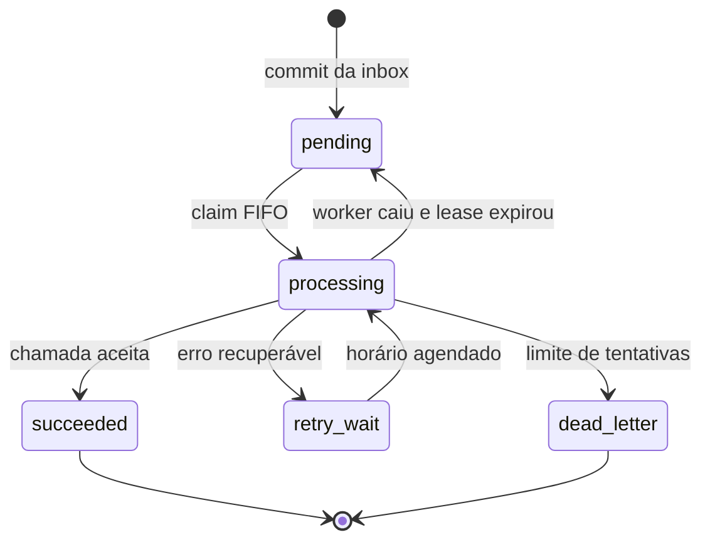

# Arquitetura operacional

## Objetivo desta fase

O caminho de ingestão faz somente autenticação, captura, criptografia,
persistência e fan-out durável. Ele não chama Conta Azul nem humanOS. Assim, a
latência ou indisponibilidade de terceiros nunca afeta a capacidade de receber
um webhook.

## Unidade atômica

O `INSERT` na `webhook_inbox` dispara um trigger no mesmo commit. O trigger:

1. incrementa um contador distribuído em 64 shards;
2. envia uma referência do webhook para `sales_conta_azul`;
3. envia outra referência para `sales_human_os`.

Se qualquer operação falhar, o Postgres desfaz tudo. A Edge Function só recebe
o recibo depois do commit e só então responde `200`.

As mensagens guardam apenas a referência e metadados de integridade; o payload
continua com uma única fonte da verdade na inbox.

`received_at` é capturado no primeiro código executado no domínio público com
precisão de milissegundos. `received_at_epoch_ms` fornece a mesma informação em
Unix milliseconds. A ordem definitiva não depende de
empates do relógio: `ingest_sequence` é alocada por uma sequência global e nunca
é reutilizada.

Além da query integral criptografada, o primeiro valor de `platform` e `event`
é materializado em `source_platform` e `source_event_type`, com índice conjunto
com `ingest_sequence` para roteamento eficiente.

## Particionamento e índices

`webhook_inbox` é particionada por hash do UUID em 16 partições. Isso distribui
inserções e atualizações de índices durante rajadas. Cada partição recebe os
índices de tempo, event ID e SHA-256 definidos no pai.

Os contadores de ingestão e conclusão usam 64 shards. O endpoint de status soma
somente essas linhas pequenas e não executa `COUNT(*)` sobre todo o histórico.
As contagens de um e cinco minutos usam os índices temporais.

## Estados por destino

PGMQ incrementa `read_ct` a cada claim. `integration_processing_state` mantém o
estado atual, `next_attempt_at`, início/fim e conclusão por destino, enquanto
`integration_attempts` preserva cada tentativa. `fail_integration_job` calcula backoff
exponencial a partir desse número, limitado a uma hora, com pequeno jitter. O
padrão é 15 tentativas. O processador deve usar `webhook_id` como chave de
idempotência no destino sempre que a API permitir: nenhum sistema distribuído
consegue impedir uma duplicação se o terceiro executar a chamada e a conexão cair
antes do ACK local.

No caso da Conta Azul, o número da venda é a chave operacional de recuperação.
Antes do `POST`, o worker consulta `/v1/venda/busca?numeros=...`. Assim, uma
reexecução após perda do ACK recupera o UUID da venda já criada em vez de criar
outra. O vínculo local por `webhook_id`, fingerprint e número mantém a auditoria.

## Concorrência dos workers

Cada destino possui configuração independente:

- `enqueue_enabled`: novos eventos entram na fila;
- `dispatch_enabled`: workers podem fazer claim;
- `visibility_timeout_seconds`: duração do lease;
- `max_attempts`: limite antes de dead-letter.

Nesta fase os dois destinos enfileiram, mas não despacham. O worker Conta Azul
usa um lease global para impedir duas execuções concorrentes e processa chamadas
em série. Cada claim pega somente o menor `ingest_sequence` ativo. Se esse item
entra em retry, o claim devolve vazio até o horário agendado; compra e reembolso
não podem inverter a ordem. O endpoint pode executar até 300 claims sequenciais.

Como a Conta Azul limita cada ERP a 10 requisições/s e 600/min, uma entrada
contínua de 100–200 eventos/s necessariamente acumulará backlog. Isso não reduz a
capacidade da inbox: a fila funciona como amortecedor e o status expõe sua idade
e tamanho.

## Falhas consideradas

| Falha | Comportamento |
|---|---|
| Chamada pública sem segredo | aceita; o proxy injeta autenticação apenas internamente |
| Acesso direto com segredo inválido | `401`; nada é armazenado |
| Banco indisponível | `503` + `Retry-After`; origem deve reenviar |
| Falha ao criar uma das filas | rollback da inbox e da outra fila |
| Worker cai durante processamento | lease expira e mensagem reaparece |
| Terceiro retorna erro temporário | retry exponencial independente |
| Tentativas esgotadas | mensagem arquivada como dead-letter |
| Conta Azul indisponível | fila humanOS continua independente |
| Dois crons Conta Azul simultâneos | somente um adquire o lease global |
| Access token perto de expirar | um worker renova; os demais aguardam |
| ACK de criação perdido | retry busca pelo número e recupera o UUID |

## Capacidade e crescimento

O teste local sustentou a oferta de 200 eventos/s por cinco segundos sem falhas.
Isso é uma validação funcional/de carga curta, não um SLA do plano Supabase.

A taxa contínua é volumosa:

- 100 eventos/s = 8.640.000 webhooks/dia;
- 200 eventos/s = 17.280.000 webhooks/dia;
- com dois destinos, 200 eventos/s cria 34.560.000 mensagens/dia antes do
  consumo.

O tamanho real depende do body e dos headers. Antes de carga contínua em produção,
é necessário medir o payload médio, escolher compute/disco/PITR adequados, testar
em staging e definir política de arquivamento frio. “Guardar tudo” pode significar
manter metadados e histórico no Postgres e mover envelopes antigos para storage
imutável, sem perder a capacidade de replay.

## Segurança

- Segredos diferentes protegem ingestão e status.
- O segredo de criptografia nunca é persistido no banco ou no Git.
- Tokens OAuth são armazenados apenas cifrados; o refresh token rotacionado é
  atualizado atomicamente sob lease.
- Chaves elevadas são usadas somente em Edge Functions.
- RLS está habilitada e não há policies para clientes.
- Funções de fila são `SECURITY DEFINER`, têm `search_path` vazio e só concedem
  execução a `service_role`.
- O status não devolve payload, headers ou texto de erro sensível.
